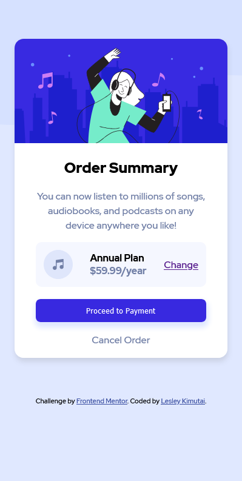

# Frontend Mentor - Order summary card solution

This is a solution to the [Order summary card challenge on Frontend Mentor](https://www.frontendmentor.io/challenges/order-summary-component-QlPmajDUj). Frontend Mentor challenges help you improve your coding skills by building realistic projects.

## Table of contents

- [Overview](#overview)
  - [The challenge](#the-challenge)
  - [Screenshot](#screenshot)
  - [Links](#links)
- [My process](#my-process)
  - [Built with](#built-with)
  - [What I learned](#what-i-learned)
  - [Continued development](#continued-development)
- [Author](#author)


**Note: Delete this note and update the table of contents based on what sections you keep.**

## Overview

### The challenge

Users should be able to:

- See hover states for interactive elements

### Screenshot

##### Mobile Preview Screenshot


This is a screenshot of the mobile look of the card.

##### Laptop Preview Screenshot


This is the laptop preview of the card.

### Links

- Solution URL: [My Soln](https://github.com/issagoodlifeInc/order-summary)
- Live Site URL: [Live-site](https://your-live-site-url.com)

## My process

### Built with

- Semantic HTML5 markup
- CSS custom properties
- Flexbox
- Mobile-first workflow

### What I learned

The difference of a contain and a cover background property.

My first mobile-first workflow 💯 ... I loved it ....didn't have to use too much media queries as always

Tried using Adobe XD for perfect layout look and ended up leaving it completely... will perfect that later ....the px dimensions generated were too big ...decided to wing it😎

```html
<h1>Some CSS I'm NOT proud of at all</h1>
```
```css
@media (min-width: 533px) {
  .summary__card {
    margin: 8rem auto;
    max-width: 370px;
  }

  .card__content {
    width: 80%;
    margin: auto;
  }
}
```

### Continued development

Overall speed
Better class names
Mobile First workflow


## Author

- Website - [Add your name here](https://www.your-site.com)
- Frontend Mentor - [Leskim](https://www.frontendmentor.io/profile/Leskim)
